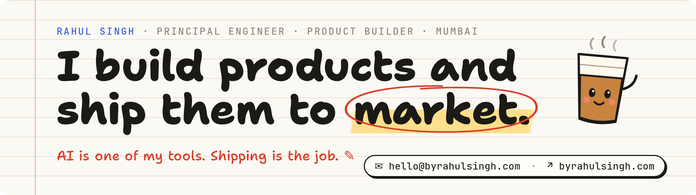

<a href="https://byrahulsingh.com">
  <picture>
    <source media="(prefers-color-scheme: dark)" srcset=".github/readme/banner-dark.png">
    
  </picture>
</a>

  
  
  
  
  

### Hey, I'm Rahul 👋

Principal Engineer at [Livlong](https://livlong.com) in Mumbai. For 11+ years I've been taking products from first commit to real users. Today I lead 15+ engineers, and I still write production code most days.

**Recently shipped**

- **livlong.com rebuild:** moved off WordPress to Next.js. Lighthouse went from 65–70 to 98–99, SEO to 100.
- **Lab-test marketplace:** built and launched end to end.
- **Internal servicing portals:** the tools Livlong's servicing teams work in.
- **AI chatbot with voice calling:** running in production.
- **AI agents across CRM, email and WhatsApp:** running in production.
- **Live chess classes at nurtr:** the company's first product, built 0 → 1, later moved from monolith to microservices.

**Stack:** Next.js · React · TypeScript · Node.js · Bun · Hono · Postgres · Drizzle · Python · LangChain · AWS
